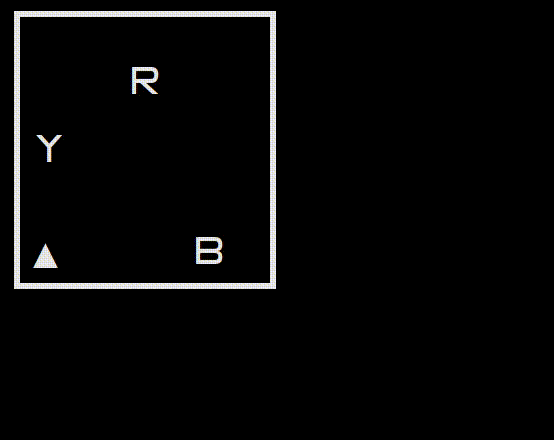

# Mine collector simulator

Simulator of a mine collector robot, written in an evening from scratch for the university course of Software Engineering 2019.

It was made to make developing an algorithm for a mine collector robot less time consuming using a virtual environment that mimics the real one, without using a physical robot for the task.

## How to use

Edit the file `seek.py` to provide an algorithm that collects all the mines in the field.

The robot can use all variables and functions listed under `public variables` and `public functions`, and should avoid using the private variables.

Execute the simulator with the command

```
$ python ./main.py
```

Once the simulation is over, press Ctrl-C to terminate it.

The simulation is better viewed using a square-shaped font, like [this one](http://strlen.com/square).

## Demo

Here's a demo of the program running, you can execute it by changing the `SOURCE_FILE` constant in `main.py` to `demo.py`.


